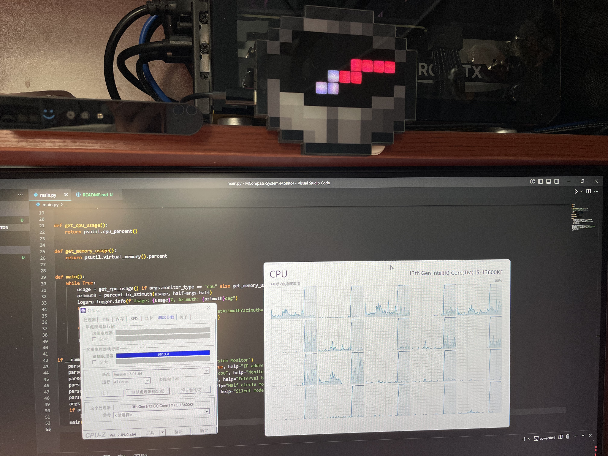

# MCompass-Sys-Monitor

基于 [chaosgoo/mcompass](https://github.com/chaosgoo/mcompass) 的 Minecraft 指南针硬件开发的系统性能监控表。



## 使用方式

将指南针连接电脑（不需要和该程序在同一台设备上），并将指南针配网连接到局域网中。

在 [Release](https://github.com/ChrisKimZHT/MCompass-Sys-Monitor/releases) 页下载对应平台的二进制文件，使用命令行运行，参数可见下文“运行参数”小节：

```shell
./MCompass-Sys-Monitor-Linux-x86_64-v1.0.0 --compass-ip 192.168.6.233 --interval 0.1
```

## 运行参数

| 参数             | 类型         | 默认值 | 说明                         |
| ---------------- | ------------ | ------ | ---------------------------- |
| `--compass-ip`   | `str`        | 必填   | 指南针配网后的 IP 地址       |
| `--monitor-type` | `str`        | `cpu`  | 监控类型，可选 `cpu`、`mem`  |
| `--interval`     | `float`      | `1.0`  | 监控间隔，单位秒             |
| `--half`         | `store_true` | 否     | 仅使用指南针上半圈显示       |
| `--silent`       | `store_true` | 否     | 静默模式，不输出任何日志     |
| `--logarithm`    | `store_true` | 否     | 对数模式，低数值时指针更灵敏 |
| `--animation`    | `int`        | 0      | 动画插值角度，0 为关闭动画   |